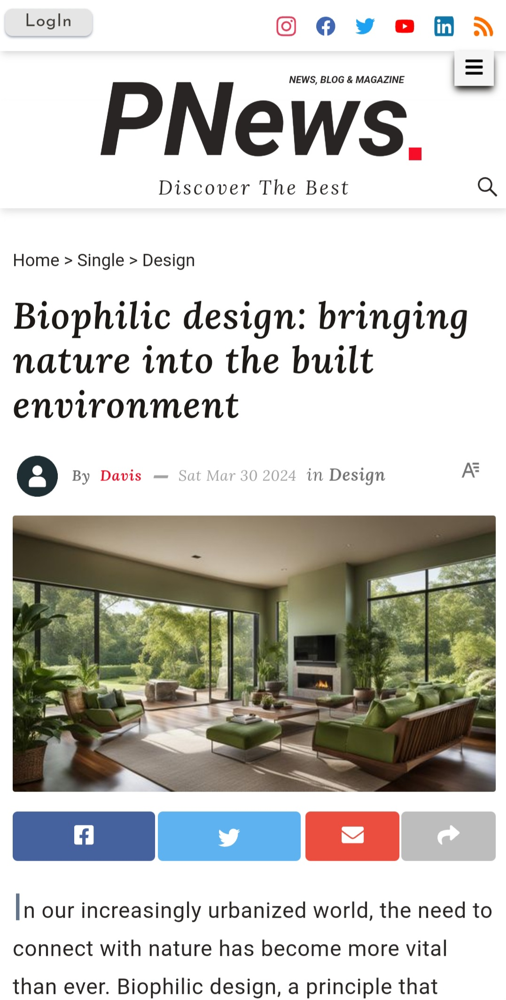
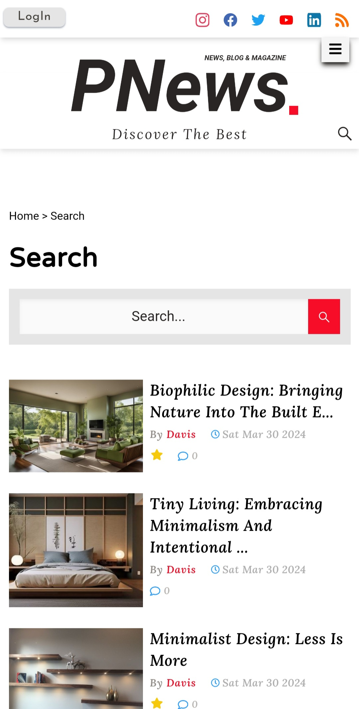
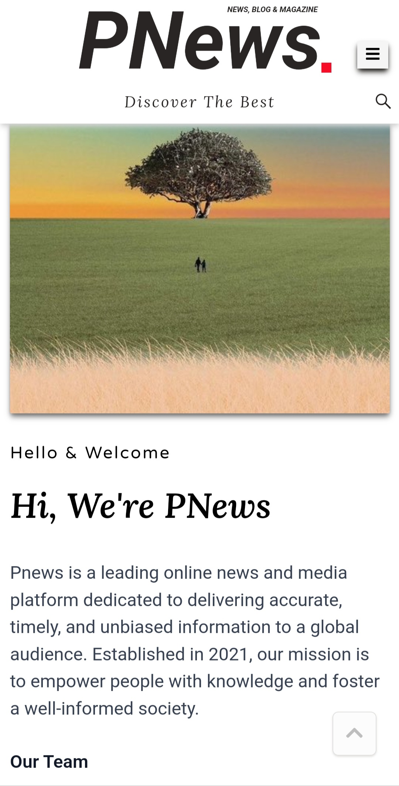

### Discover The Best

# <h1 align='center'>[PNEWS](https://pnews-sc7h.onrender.com/)</h1>

<div align="center">
  <table>
    <tr>
      <td>
              
      </td>
      <td>
              
      </td>
      <td>
        
      </td>
      <td>
              
      </td>
      <td>
              
      </td>
      <td>
              
      </td>
    </tr>
  </table>
</div>

## Overview

PNews is a pioneering online news and media platform that has swiftly emerged as a trusted source for accurate, timely, and unbiased information on a global scale. Founded in 2021, our unwavering mission is to empower individuals and cultivate a well-informed society by providing access to a comprehensive range of news, analysis, and insights.

PNews is a dynamic and versatile platform meticulously designed to function as a premier blog, news, and magazine aggregator service. Our platform seamlessly integrates cutting-edge technologies and a team of dedicated professionals to curate an uninterrupted stream of high-quality content from a diverse array of reputable publishers, magazines, and subject matter experts.

Through our user-friendly interface, PNews offers an immersive and personalized experience, enabling users to effortlessly navigate and discover content tailored to their interests. Our advanced algorithms continuously scan and analyze vast amounts of data, ensuring that the most relevant and trustworthy articles are surfaced and presented in an engaging and visually appealing manner.

At PNews, we prioritize editorial integrity, adhering to stringent standards of fact-checking and objectivity. Our dedicated team of editors and analysts diligently vets and verifies the information before publishing, ensuring that our readers receive accurate and reliable insights.

> [!Warning]
> In the ever-evolving landscape of online media, PNews has embraced cutting-edge artificial intelligence technologies to address the shortage of human writers and ensure a continuous flow of high-quality content for our global audience. While traditional news platforms heavily rely on human writers, our innovative approach leverages the power of advanced language models and machine learning algorithms to generate a significant portion of the content featured on our website.

> [!Tip]
> PNews offers an intuitive and user-friendly navigation experience. Each main page features a comprehensive list of categories and tags accessible through a simple hover action on the dropdown arrow or by clicking the relevant category at the bottom of the page or by clicking tag directly on a post.
>
> PNews provides a convenient post search functionality, readily accessible by clicking the three bar icon located at the top right of the page and then the search icon.
>
> The post page on PNews allows users to adjust the text size according to their preference by simply interacting with the 'A' icon above the post main image, offering a comfortable reading experience.

Also, Feel free to explore our website! You never know what amazing discoveries await you.

## The Problem

We recognize that human expertise and editorial oversight are crucial in providing context, nuance, and depth to complex issues. PNews actively seeks contributions from respected human writers, subject matter experts, and thought leaders.

## Current Status

**LIVE LINK:** https://pnews-sc7h.onrender.com/

## Future Plans

> [!Note]
> Add more features like: Allowing users to save favorite Posts.
> Add more writers and less AI contents
> Have a Pnews App

## Running the Project

This project is being built with React Js.

To run a version locally on your own machine

Optional:

```bash
#make a directory and change into it:
mkdir newDirectory && cd newDirectory
```

Required:

```bash
#clone the repository into the current directory over SSH:
git clone https://github.com/ChiemezieSamson/UmehBlogNewsMagazine
#change into newly cloned directory:
cd
#run this command to install all dependencies:
npm install
```

for a local development server, run:

```bash
npm run start
```

run this commmand to build:

```bash
npm run build
```

## Dev Dependencies

- [@tailwindcss/forms](https://github.com/tailwindlabs/tailwindcss-forms)
- [@tailwindcss/typography](https://github.com/tailwindlabs/tailwindcss-typography)
- [autoprefixer](https://www.npmjs.com/package/autoprefixer)
- [postcss](https://postcss.org/)
- [tailwindcss](https://tailwindcss.com/)
